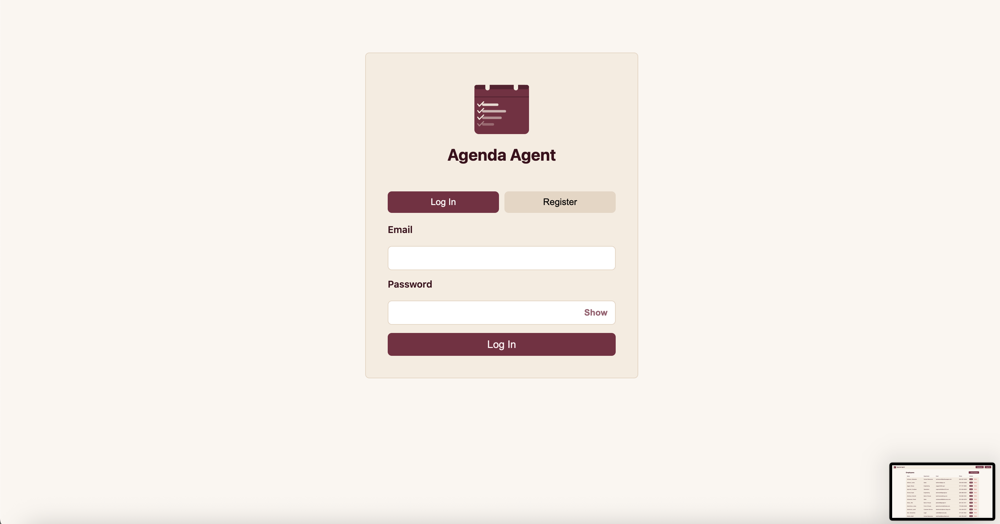
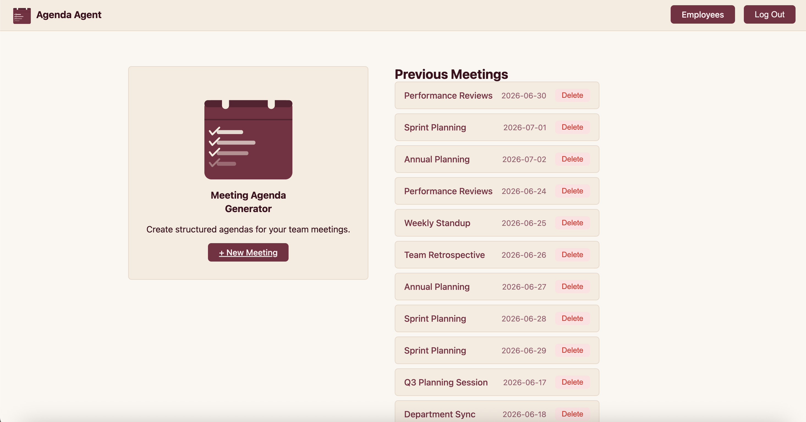
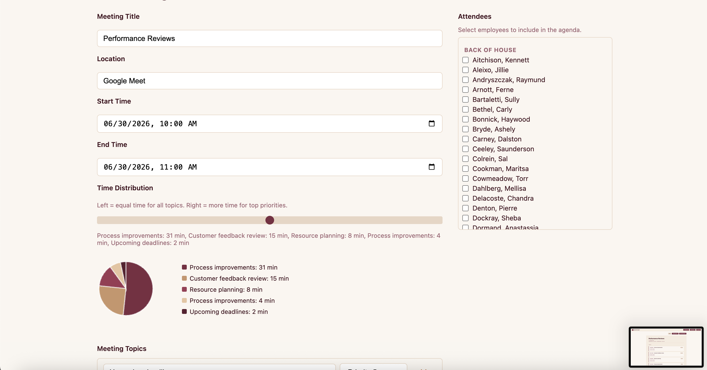
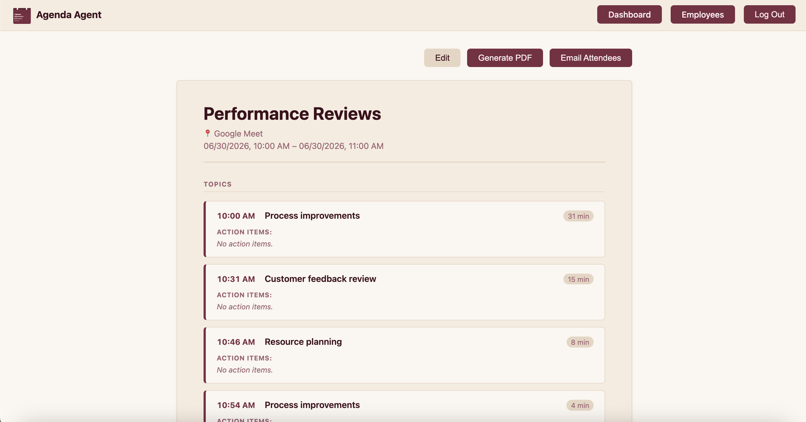
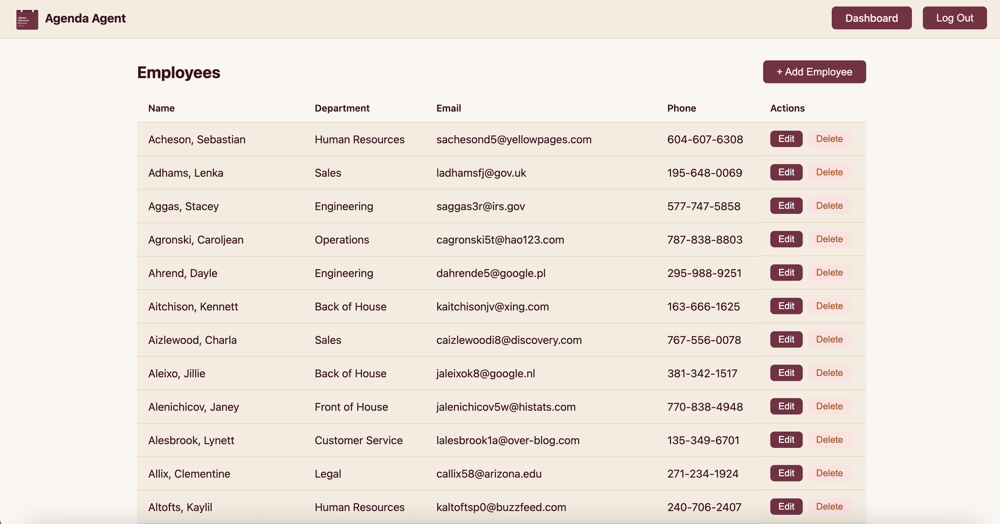

# AGENDA AGENT

Meeting Agenda Generator using Node, Express, MongoDB, ES6 Vanilla, HTML5

## Project Objective

To build a full-stack web application that helps managers and teams generate structured meeting agendas. Users create meetings with topics, assign priority ranks, and use a time distribution slider to allocate meeting time across topics using a geometric decay algorithm. Agendas can be exported as PDFs or emailed directly to attendees.

## Class

[CS 5610 Web Development](https://johnguerra.co/classes/webDevelopment_online_summer_2026/)
Khoury College of Computer Sciences, Northeastern University

## Demo Account

A demo account has been pre-loaded with sample data so you can explore the application without creating an account or adding data manually.

### Login Credentials

| Field    | Value        |
| -------- | ------------ |
| Email    | demo@neu.edu |
| Password | Northeastern |

### What's Included

- 1,000 employees across multiple departments imported from Mockaroo
- 20 sample meetings with realistic titles, locations, topics, and attendees

### How to Access

Local:

1. Start the server with `npm run dev`
2. Go to `http://localhost:3000` in your browser
3. Enter the credentials above and click **Log In**
4. You will land on the dashboard where all 20 sample meetings are listed
5. Click any meeting to view its agenda, export it as a PDF, or email it to attendees
6. Navigate to **Employees** to browse the full roster of 1,000 employees

Or directly go to the live site: `https://meeting-agenda.onrender.com/auth.html`

### Resetting the Demo Data

If the demo data gets modified or deleted, you can restore it by running:

```bash
node backend/demoUser.js
```

This will clear the existing demo data and re-seed the database fresh.

---

## Project Setup

### Prerequisites

- Node.js v18+
- MongoDB (local or Atlas)

### Installation

```bash
npm install
```

### Environment Variables

Create a `.env` file in the project root with the following:

```
PORT=3000
MONGODB_URI=mongodb+srv://<username>:<password>@<cluster>.mongodb.net/
DB_NAME=ai_meeting_generator
JWT_SECRET=<your_jwt_secret>
BREVO_API_KEY=<your_brevo_api_key>
EMAIL_FROM=<your_verified_sender_email>
EMAIL_FROM_NAME=Agenda Agent

```

To obtain these values:

- **MONGODB_URI** - create a free cluster at [mongodb.com/atlas](https://mongodb.com/atlas)
- **BREVO_API_KEY** - sign up at [brevo.com](https://brevo.com) and generate an API key
- **EMAIL_FROM** - a verified sender email in your Brevo account

### Running the App

```bash
npm run dev
```

Then go to `http://localhost:3000` in your browser.

---

## Features

- Create meetings with title, location, start/end times, topics, and attendees
- Assign unique priorities to topics (1 = highest priority)
- Time Distribution slider — controls how aggressively time is front-loaded toward top-ranked topics
- Live preview of time allocation per topic as you adjust the slider
- Generate a formatted PDF agenda
- Email the agenda to all meeting attendees
- Edit action items directly on the agenda page
- View all previous meetings from the dashboard

---

## Project Structure

```
backend/
  app.js                  — Express server entry point
  config/
    database.js           — MongoDB connection
    passport.js           — Passport auth config
  controllers/
    authController.js     — Auth logic
    employeeController.js — Employee CRUD
    meetingController.js  — Meeting CRUD + time allocation
  models/
    agendaModel.js        — Agenda schema reference
    employeeModel.js      — Employee factory
    meetingModel.js       — Meeting factory
    userModel.js          — User factory
  routes/
    auth.js               — Auth routes
    employees.js          — Employee routes
    meetings.js           — Meeting, PDF, email routes
    actionItems.js        — Action item routes
  services/
    emailService.js       — Nodemailer email delivery
    pdfService.js         — PDFKit agenda generation
  utils/
    auth.js               — JWT middleware
    timeAllocation.js     — Geometric decay scheduling algorithm
  demoUser.js             — Demo data seed script
frontend/
  auth.html / js/auth.js
  dashboard.html / js/dashboard.js
  meetings.html / js/meetings.js
  agenda.html / js/agenda.js
  employees.html / js/employees.js
  css/                    — Per-page CSS modules
```

---

## Screenshots







---

## Authors

- Barbara Louyakis
- Aleena Mary Karatra

CS 5610 Web Development — Khoury College of Computer Sciences, Northeastern University

---

## AI Assistance

Portions of this project were developed with the assistance of Claude (Anthropic), an AI assistant.

Specifically, Claude Sonnet 4.6 was used to generate the `demoUser.js` seed script, which creates a demo user account, imports employee data from Mockaroo, and populates sample meeting records in MongoDB for demonstration purposes.

- Tool: Claude by Anthropic
- Version: Claude Sonnet 4.6
- URL: https://claude.ai
- Date: June 2026

---

## License

MIT
